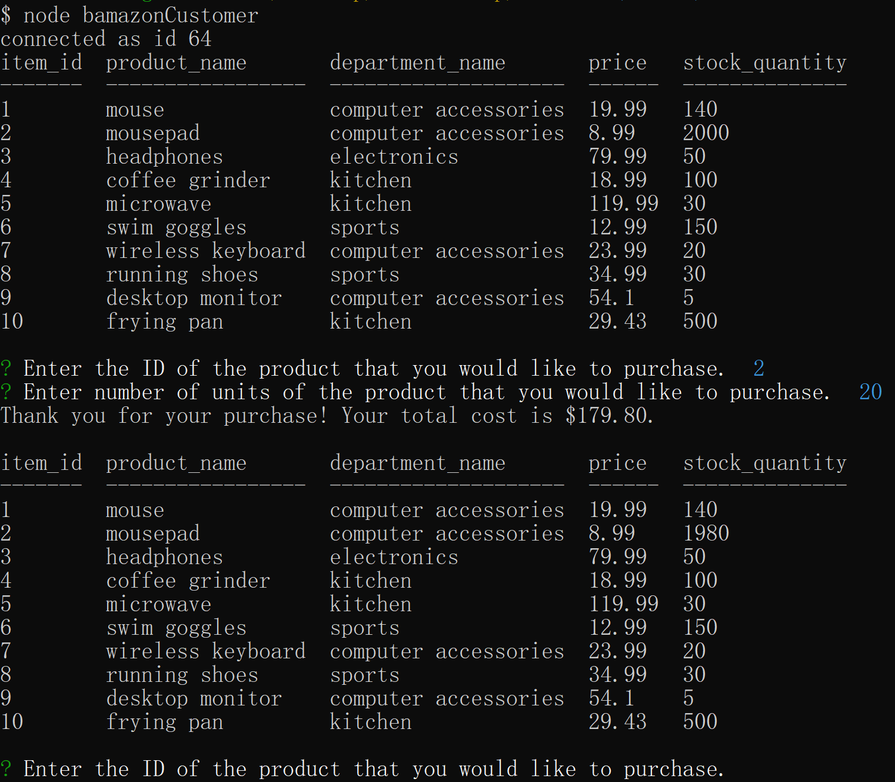
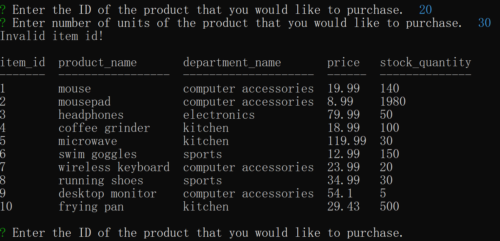
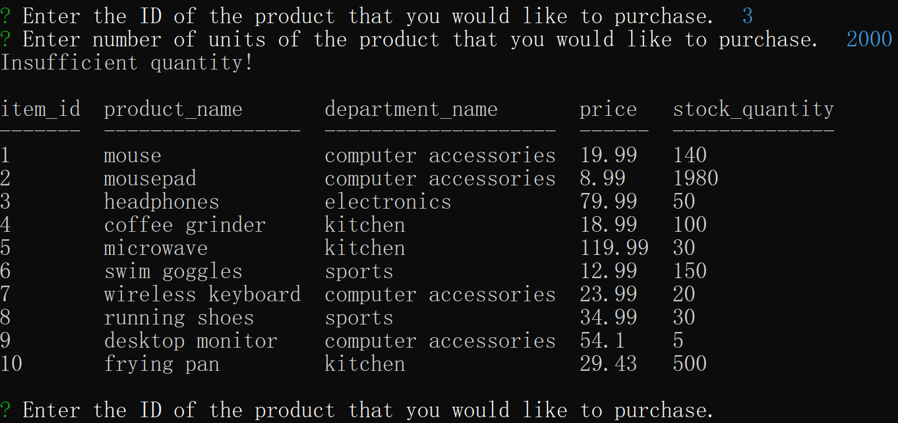
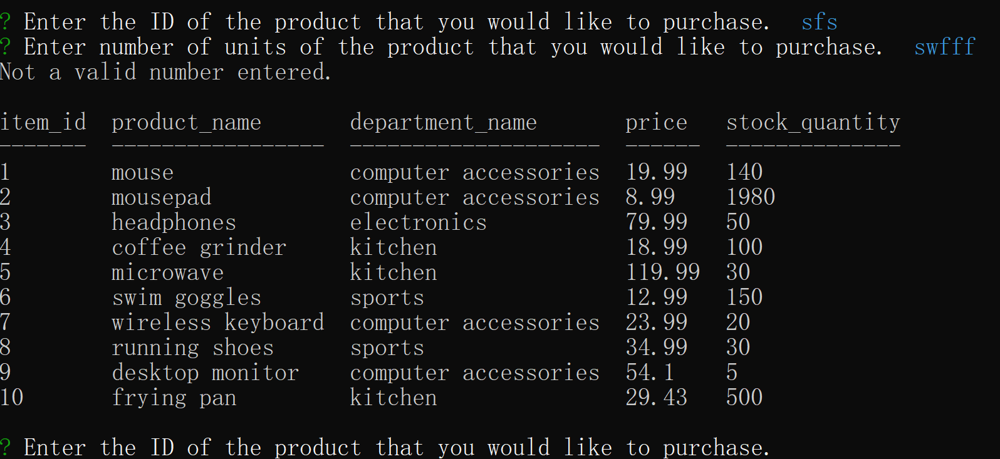

# Bamazon

### Overview
This is an Amazon-like storefront with MySQL. This app will take in orders from customers and deplete stock from the store's inventory.

### Customer View

1. Create a MySQL Database called `bamazon`.
1. Create a Table inside of the database called `products`.
1. The table contains the following columns:
    * `item_id` (unique id for each product)
    * `product_name` (Name of product)
    * `department_name`
    * `price` (cost to customer)
    * `tock_quantity` (how much of the product is available in stores)

#### Run `node bamazonCustomer` to start.

##### Successfully puchased

##### Invalid inputs

* Invalid ID:

* Insufficient Quantity

* Invalid Input

